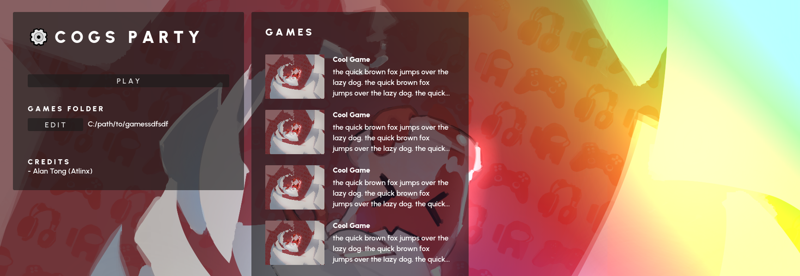

# ⚙ COGS Party

A party game with a collection of club member made minigames. Every semester, members work together to contribute a single minigame to COGS party.

## Minigames

Minigames should run on Windows, MacOS, and/or Linux platforms. Any other platforms are not supported.

### Folder Format

Minigames are stored under a shared folder that the COGS Party Launcher can then read. Each minigame has its own folder, which contains a `game.json` file.

Only the `game.json` file is necessary, however you may want to add additional files to provide a customer banner for your game, as well as folders to store different builds of your game for different platforms.

The format of a minigame folder is as follows:

- `[NameOfGame]`
  - banner.png
  - [game.json](#gamejson)
  - windows
    - `windows build files`
  - macos
    - `macos build files`
  - linux
    - `linux build files`

### `game.json`

This [JSON](https://developer.mozilla.org/en-US/docs/Learn/JavaScript/Objects/JSON) file is required for every minigame. This file tells the COGS Party Launcher information about your game, such as the title, description, authors, min/max players, and where to find runnable builds of the game.

An example of this file is shown below

```json
{
  "title": "Godot Test Game",
  "description": "A simple counting game with friends written in Godot!",
  "banner": "./banner.png",
  "date": "7/26/2023",
  "developers": ["Alan"],
  "engine": "Godot",
  "min_players": 2,
  "max_players": 4,
  "builds": {
    "windows": "./windows/GodotTestGame.exe"
  }
}
```

Here is more detailed documentation on all the supported fields within this JSON fie.

- `title: String`
  - Title of your minigame
- `description: String`
  - Short description of your minigame
- `banner: String`
  - Relative file path from your minigame folder to the banner image.
  - This image can be a `png` or `jpeg`
- `date: String`
  - Date of when the game was made
- `developers: String[]`
  - List of the names of the developers
- `engine: String`
  - Game engine used to develop your minigame
- `min_players: int`
  - Minimum number of players your minigame supports
- `max_players: int`
  - Maximum number of players your minigame supports
- `builds: Dictionary`

  - Dictionary that maps a platform name to the relative file path from your minigame folder to the executable file for that platform
  - Valid platform names are `windows`, `macos`, and `linux`.
  - **Ex.**
    - ```json
      "builds": {
        "windows": "./windows/win_executable.exe",
        "macos": "./macos/mac_executable",
        "linux": "./linux/linux_executable"
      }
      ```

## Minigame Manager Libraries

Minigames communicate with the launcher by reading and writing to a save file. This is often done through some sort of "minigame manager library," which is one or more files that people can insert into their minigame to easily communicate with the launcher.

### Pre-Made Libraries

This repository comes with some example minigames written in various engines. Within each example, there are instructions on how to download the necessary minigame manager files to add to an existing project.

Here's a list of the current supported examples

- [Unity](./UnityTestGame/README.md)
- [Godot](./GodotTestGame/README.md)
- [GameMaker](./GameMakerTestGame/README.md)

### Custom Library

If there isn't a pre-made library for your minigame's game engine and you can write a minigame manager library for your engine.

#### Lifecycle

Here's the lifecycle of a minigame when it's launched by the COGS Party Launcher.

1. COGS Party Launcher launches the minigame
   - The executable used to based on the COGS Party Launcher's current platform
     - **Ex.** If the launcher is running on MacOS, it will run the MacOS version of the minigames
   - The executable is launched with the following command:
     - `./path/to/game/executable "--savefile=./path/to/save_file.json"`
     - You can parse the second parameter of the command within your minigame to locate the path to the save file
2. Minigame reads from `./path/to/save_file.json`
   - Initialize player characters using the `players` player data array
     - See [save_file.json](#save_filejson) for more information
3. Minigame begins
4. Minigame ends
   - Decide what points to give to each player
   - Write a new result entry to `games` inside the `./path/to/save_file.json`
     - See [save_file.json](#save_filejson) for more information
   - Terminate your minigame program

#### `save_file.json`

The save file shared between minigame and launcher has the following format:

```json
{
  "players": [
    {
      "color": "#a83232",
      "points": 0
    },
    {
      "color": "#63a832",
      "points": 0
    },
    {
      "color": "#327ba8",
      "points": 2
    },
    {
      "color": "#7932a8",
      "points": 0
    }
  ],
  "games": [
    {
      "name": "Test Game",
      "results": [
        {
          "player": 0,
          "points": 1
        },
        {
          "player": 1,
          "points": 3
        }
      ]
    },
    {
      "name": "Other Game",
      "results": [
        {
          "player": 2,
          "points": 1
        }
      ]
    }
  ]
}
```

Here is more detailed documentation on all the supported fields within this JSON fie.

- `players: Array`
  - Array of player data
    - **Ex.**
      - `players[0]` = player one's data
      - `players[1]` = player two's data
  - PlayerData
    - `color: String`
      - Hexadecimal string representation of the color of the player
      - This should be displayed on the player character in the minigame
    - `points: int`
      - Number of points this player currently has
- `games: Array`
  - Array of game results from previous minigames
  - GameResult
    - `name: String`
      - Name of the minigame that generated this result
    - `results: Array`
      - Array of player results
      - PlayerResult
        - `player: int`
          - Index of a player that received points
        - `points: int`
          - Amount of points that this player received
      - **Ex.**
        - ```json
          {
            "player": 0,
            "points": 3
          }
          ```
        - Player one earns 3 points

## COGS Party Repository Development

The following sections are for development of the COGS Party Repository

## Adding New Test Games

If there is demand for a minigame manager library for a specific engine, you can make a new test game under this repository for that engine. Make sure your test game folder is named `[EngineName]TestGame`, and include a `README.md` file inside the folder to describe how to install and use the engine's minigame manager library. Make sure to also update the list under [Pre-Made Libraries](#pre-made-libraries) to link to your new test game's `README.md` file. You can look at existing test games to see how minigame manager libraries are built, and how your `README.md` file should be formatted.

## Build + Bundling Test Games

A good way to test all the test games together is to build and and bundle the test games with the launcher. This extracts the launcher builds + games into a dedicated folder that can then be shared with others to test the launcher + games on different platforms.

If you want to build and bundle the test games in this repository, then follow these steps:

1. Open the COGS Party Launcher Godot project, and build the launcher for Windows, MacOS, and Linux under the `CogsPartyLauncher/builds` folder.
   - `builds` folder should have a `windows`, `linux`, and `macos` folder, which contain the final builds for each corresponding platform
   - For `macos`, you should extract the zip file
2. Open each test game project and build for the three different platforms, making sure the final build files end up underneath the project's minigame folder located at `Games/[XXX]TestGame`
   - `Games/[XXX]TestGame` should have a `windows`, `linux`, and `macos` folder, which contain the final builds for each corresponding platform
3. Run the `build.sh` or `build.bat` file to bundle `CogsPartyLauncher/builds` and the `Games` folder together.
   - Note that running the `build.bat` file require git bash to be installed.
